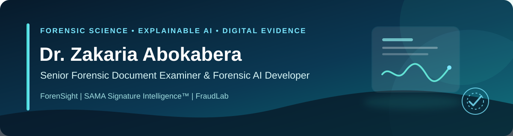

  

# Dr. Zakaria Abokabera

**Senior Forensic Document Examiner · Forensic AI Developer · Researcher · Professional Trainer**

I combine more than 19 years of forensic practice with applied research and software development in questioned documents, signature examination, document security, banking fraud, digital evidence, and explainable artificial intelligence.

My work focuses on translating forensic expertise into practical, auditable tools for justice institutions, financial organizations, universities, and specialized training academies.

[Research identity: ORCID](https://orcid.org/0000-0001-5952-8246) · [Public repositories](https://github.com/Abokabera2024?tab=repositories)

## Core expertise

- Forensic examination of documents, handwriting, signatures, stamps, identity documents, and banknotes
- Explainable AI for forensic decision support
- Document security, authentication, and counterfeit detection
- Banking fraud, cybercrime, and digital evidence
- Python and MATLAB application development
- Academic research, professional training, and technical consultancy

## Selected platforms

### ForenSight

A bilingual knowledge and intelligence platform covering forensic document examination, signature security, digital investigations, cybersecurity, banking fraud, and emerging AI tools.

### SAMA Signature Intelligence™

An offline explainable-AI system supporting forensic signature examination, including Arabic-script signatures. Public information is intentionally limited to protect registered intellectual property and confidential implementation details.

### FraudLab

An interactive professional training platform built around realistic banking-fraud scenarios for operational teams, risk functions, investigators, and security professionals.

## Selected research and development

| Project | Focus | Explore |
| --- | --- | --- |
| **AI-Enhanced PCA for Spectroscopic Data** | Desktop tools for PCA, spectroscopic data visualization, and result export | [Repository](https://github.com/Abokabera2024/AI-Enhanced-PCA-for-Spectroscopic-Data) · [Related publication](https://doi.org/10.1039/D5AY00027K) |
| **BlindReader** | An accessibility-oriented bilingual software project | [Repository](https://github.com/Abokabera2024/BlindReader) |
| **Document Search App** | Document retrieval and knowledge-access tooling | [Repository](https://github.com/Abokabera2024/document-search-app) |

## Research identity

**ORCID:** [0000-0001-5952-8246](https://orcid.org/0000-0001-5952-8246)

## Collaboration

I welcome professional and research collaboration in forensic document science, signature examination, document and currency security, explainable AI, banking-fraud prevention, digital evidence, and specialized capacity building.

> Public repositories present selected, non-confidential work only. Proprietary algorithms, operational case data, security controls, and protected datasets are not published.
